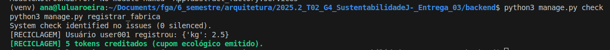
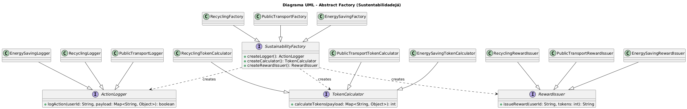

# 3.1.4. Abstract Factory - SustentabilidadeJá


## 1. Introdução

No desenvolvimento orientado a objetos, é comum a necessidade de criar grupos de objetos que pertençam a uma mesma família, mantendo compatibilidade entre eles e evitando o acoplamento direto entre o código cliente e as classes concretas.  
O uso direto de `new` pode gerar dependências rígidas, dificultando a manutenção e a expansão do sistema.

O padrão de projeto criacional **Abstract Factory** resolve esse problema ao fornecer uma interface para criar famílias de objetos relacionados ou dependentes sem especificar suas classes concretas.  
Isso promove **baixo acoplamento**, **alta coesão** e **facilidade de expansão**.

No contexto do projeto **SustentabilidadeJá**, o padrão foi utilizado para gerenciar diferentes tipos de ações sustentáveis, como reciclagem, transporte público e economia de energia, que seguem o mesmo fluxo (**registro → cálculo de tokens → emissão de recompensa**), mas possuem regras específicas.  
O **Abstract Factory** permite tratar essas variações como famílias de objetos compatíveis, sem alterar o código cliente.


## 2. Metodologia

A aplicação do padrão seguiu quatro etapas principais:

### 2.1. Análise do Domínio

Foram identificadas as ações sustentáveis que compõem o sistema, todas seguindo a mesma estrutura:

- Registrar uma ação sustentável;
- Calcular tokens gerados;
- Emitir uma recompensa (cupom, desconto ou benefício).

Cada tipo de ação (Reciclagem, Transporte, Energia) forma uma família de objetos relacionados, o que justificou o uso do **Abstract Factory**.

### 2.2. Modelagem da Solução

A estrutura projetada define:

- **Fábrica Abstrata:** `SustainabilityFactory`  
  Define métodos para criar `ActionLogger`, `TokenCalculator` e `RewardIssuer`.

- **Fábricas Concretas:**  
  `RecyclingFactory`, `PublicTransportFactory` e `EnergySavingFactory` implementam a interface e geram produtos específicos.

- **Produtos Abstratos:**  
  `ActionLogger`, `TokenCalculator` e `RewardIssuer`.

- **Produtos Concretos:**  
  Implementações específicas para cada tipo de ação sustentável, como `RecyclingLogger`, `PublicTransportTokenCalculator`, `EnergySavingRewardIssuer`, etc.

### 2.3. Tecnologias Utilizadas

| Elemento | Especificação |
|-----------|----------------|
| **Linguagem** | Python |
| **Paradigma** | Orientação a Objetos |
| **Padrão** | Abstract Factory (GoF Criacional) |
| **Ambiente** | VS Code / Jupyter / PyCharm |
| **Versão Python** | 3.11+ |


## 3. Implementação

### 3.1. Interfaces dos Produtos Abstratos

```python
# ActionLogger.py
from abc import ABC, abstractmethod

class ActionLogger(ABC):
    @abstractmethod
    def logAction(self, userId: str, payload: dict) -> bool:
        pass


# TokenCalculator.py
from abc import ABC, abstractmethod

class TokenCalculator(ABC):
    @abstractmethod
    def calculateTokens(self, payload: dict) -> int:
        pass


# RewardIssuer.py
from abc import ABC, abstractmethod

class RewardIssuer(ABC):
    @abstractmethod
    def issueReward(self, userId: str, tokens: int) -> str:
        pass
```

### 3.2. Interface da Fábrica Abstrata
```python
# SustainabilityFactory.py
from abc import ABC, abstractmethod
from ActionLogger import ActionLogger
from TokenCalculator import TokenCalculator
from RewardIssuer import RewardIssuer

class SustainabilityFactory(ABC):
    @abstractmethod
    def createLogger(self) -> ActionLogger:
        pass

    @abstractmethod
    def createCalculator(self) -> TokenCalculator:
        pass

    @abstractmethod
    def createRewardIssuer(self) -> RewardIssuer:
        pass
```
### 3.3. Fábricas e Produtos Concretos
## Fábrica de Reciclagem
```python
# RecyclingFactory.py
from SustainabilityFactory import SustainabilityFactory
from RecyclingLogger import RecyclingLogger
from RecyclingTokenCalculator import RecyclingTokenCalculator
from RecyclingRewardIssuer import RecyclingRewardIssuer

class RecyclingFactory(SustainabilityFactory):
    def createLogger(self):
        return RecyclingLogger()

    def createCalculator(self):
        return RecyclingTokenCalculator()

    def createRewardIssuer(self):
        return RecyclingRewardIssuer()

# RecyclingLogger.py
from ActionLogger import ActionLogger

class RecyclingLogger(ActionLogger):
    def logAction(self, userId: str, payload: dict) -> bool:
        print(f"[RECICLAGEM] Usuário {userId} registrou: {payload}")
        return True

# RecyclingTokenCalculator.py
from TokenCalculator import TokenCalculator

class RecyclingTokenCalculator(TokenCalculator):
    def calculateTokens(self, payload: dict) -> int:
        kg = payload.get("kg", 0)
        return int(kg / 0.5)

# RecyclingRewardIssuer.py
from RewardIssuer import RewardIssuer

class RecyclingRewardIssuer(RewardIssuer):
    def issueReward(self, userId: str, tokens: int) -> str:
        return f"[RECICLAGEM] {tokens} tokens creditados (cupom ecológico emitido)"

```
## Fábrica de Transporte Público
```python
# PublicTransportFactory.py
from SustainabilityFactory import SustainabilityFactory
from PublicTransportLogger import PublicTransportLogger
from PublicTransportTokenCalculator import PublicTransportTokenCalculator
from PublicTransportRewardIssuer import PublicTransportRewardIssuer

class PublicTransportFactory(SustainabilityFactory):
    def createLogger(self):
        return PublicTransportLogger()

    def createCalculator(self):
        return PublicTransportTokenCalculator()

    def createRewardIssuer(self):
        return PublicTransportRewardIssuer()

# PublicTransportLogger.py
from ActionLogger import ActionLogger

class PublicTransportLogger(ActionLogger):
    def logAction(self, userId: str, payload: dict) -> bool:
        print(f"[TRANSPORTE] Ação registrada: {payload}")
        return True

# PublicTransportTokenCalculator.py
from TokenCalculator import TokenCalculator

class PublicTransportTokenCalculator(TokenCalculator):
    def calculateTokens(self, payload: dict) -> int:
        viagens = payload.get("viagens", 0)
        return viagens * 2

# PublicTransportRewardIssuer.py
from RewardIssuer import RewardIssuer

class PublicTransportRewardIssuer(RewardIssuer):
    def issueReward(self, userId: str, tokens: int) -> str:
        return f"[TRANSPORTE] {tokens} tokens convertidos em créditos de mobilidade."

```

## Fábrica de Economia de Energia
```python
# EnergySavingFactory.py
from SustainabilityFactory import SustainabilityFactory
from EnergySavingLogger import EnergySavingLogger
from EnergySavingTokenCalculator import EnergySavingTokenCalculator
from EnergySavingRewardIssuer import EnergySavingRewardIssuer

class EnergySavingFactory(SustainabilityFactory):
    def createLogger(self):
        return EnergySavingLogger()

    def createCalculator(self):
        return EnergySavingTokenCalculator()

    def createRewardIssuer(self):
        return EnergySavingRewardIssuer()

# EnergySavingLogger.py
from ActionLogger import ActionLogger

class EnergySavingLogger(ActionLogger):
    def logAction(self, userId: str, payload: dict) -> bool:
        print(f"[ENERGIA] Ação registrada: {payload}")
        return True

# EnergySavingTokenCalculator.py
from TokenCalculator import TokenCalculator

class EnergySavingTokenCalculator(TokenCalculator):
    def calculateTokens(self, payload: dict) -> int:
        kwh = payload.get("kwh", 0)
        return min(20, int(kwh))

# EnergySavingRewardIssuer.py
from RewardIssuer import RewardIssuer

class EnergySavingRewardIssuer(RewardIssuer):
    def issueReward(self, userId: str, tokens: int) -> str:
        return f"[ENERGIA] {tokens} tokens convertidos em desconto na conta de luz."
```
### 3.4. Classe Cliente (Uso do Abstract Factory)

```python
# App.py
from RecyclingFactory import RecyclingFactory

def main():
    factory = RecyclingFactory()

    payload = {"kg": 2.5}

    logger = factory.createLogger()
    calc = factory.createCalculator()
    reward = factory.createRewardIssuer()

    logger.logAction("user001", payload)
    tokens = calc.calculateTokens(payload)
    print(reward.issueReward("user001", tokens))

if __name__ == "__main__":
    main()

```


## 4. Modelagem do Abstract Factory

**Figura 1 - Diagrama UML do Abstract Factory (SustentabilidadeJá)**



**Fonte:** Ana Luiza Komatsu


## 5. Senso Crítico e Trabalho em Equipe

A adoção do padrão **Abstract Factory** no projeto *SustentabilidadeJá* trouxe benefícios claros:

- **Desacoplamento:** o cliente não conhece as classes concretas de cada tipo de ação.  
- **Extensibilidade:** novas ações (ex.: economia de água, plantio de árvores) podem ser adicionadas criando novas fábricas e produtos, sem alterar o código existente.  
- **Coerência:** cada fábrica gera apenas produtos compatíveis entre si, garantindo consistência no fluxo de criação.

O trabalho em equipe envolveu a **análise do domínio**, **modelagem**, **codificação** e **geração do diagrama UML**.  
A integração entre design e implementação assegurou que o padrão fosse aplicado corretamente conforme as boas práticas da disciplina.


## 6. Conclusão

O padrão **Abstract Factory** se mostrou ideal para o domínio do *SustentabilidadeJá*, ao permitir a criação de famílias completas de objetos relacionados (registro, cálculo e recompensa) sem acoplamento direto entre classes concretas.  
O resultado é uma arquitetura mais **modular**, **coesa** e preparada para futuras expansões, além de reforçar os princípios **SOLID** de design orientado a objetos.


## 7. Referências

- **SERRANO, Milene.** *Arquitetura e Desenho de Software - Aula GoFs Criacionais.* Universidade de Brasília, 2025.  
- **Refactoring.Guru**  *https://refactoring.guru/pt-br/design-patterns/abstract-factory*  
- **Wikipedia (2023)**  *https://pt.wikipedia.org/wiki/Abstract_factory*  
- **MIRANDA, Nelson.** *Desvendando os Padrões de Projeto: Abstract Factory e Factory Method.* Medium, 2023.

## Vídeo de explicação do diagrama de UML Abstract Factory

https://youtu.be/anJKE48r9Lw

## Participação na Produção do Artefato

| Nome do Integrante | Artefato | Descrição da Contribuição | Análise Crítica |
|--------------------|----------|---------------------------|-----------------|
| Ana Luiza Komatsu | Abstract Method  |  |  |
| Gustavo Gontijo | Abstract Method  |  |  |
| Davi Emanuel | Abstract Method  |  |  |

## Histórico de Versões
@@ -150,6 +151,7 @@ Abstract Method
| ------ | ------------------------------------ | ------------------------------------------------------------------------------------------------- | ---------- | ----------------------------------------------------------------------------------------------------------- | --------- |
| 1.0    | Criação do documento, com introdução, metodologia, o código e diagrama | [Ana Luiza Komatsu](https://github.com/luluaroeira), [Gustavo Gontijo](https://github.com/Guga301104) e [Davi Emanuel](https://github.com/daviRolvr) | 23/10/2025 |  | |
| 1.1    | Adicionando explicação do código e gravação do diagrama| [Ana Luiza Komatsu](https://github.com/luluaroeira), [Gustavo Gontijo](https://github.com/Guga301104) e [Davi Emanuel](https://github.com/daviRolvr) | 24/10/2025 |  | |
| 1.2    | Ajustes| [Ana Luiza Komatsu](https://github.com/luluaroeira), [Gustavo Gontijo](https://github.com/Guga301104) e [Davi Emanuel](https://github.com/daviRolvr) | 24/10/2025 |  | |


