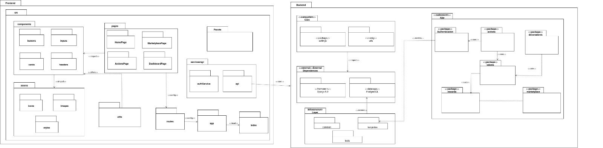

# 3.5. Iniciativas Extras (Padrões de Projeto)

Breve relato sobre as Iniciativas Extras realizadas pela equipe, no escopo da entrega.

Apresentar links para comprobatórios que evidenciem qualquer que seja a realização extra conferida pela equipe no escopo da entrega.

## Atualização do Diagrama de Pacotes - Implementação dos Decoradores

### Introdução

Como iniciativa extra, a equipe realizou a atualização do [Diagrama de Pacotes](https://github.com/UnBArqDsw2025-2-Turma02/2025.2_T02_G4_SustentabilidadeJ-_Entrega_02/blob/main/docs/Modelagem/2.3.1.DiagramaDePacote.md) desenvolvido na Entrega 2, incorporando o pacote de decoradores (`decorators`) implementado nesta entrega com os padrões GOFs.

## Diagrama Atualizado

O diagrama de pacotes é um diagrama estrutural que tem por objetivo representar os subsistemas ou submódulos englobados por um sistema de forma a determinar as partes que o compõem. Pode ser utilizado de maneira independente ou associado com outros diagramas. [1] (GUEDES, 2011, p. 33).

### Contexto

Na Entrega 2, foi desenvolvido o diagrama de pacotes inicial do projeto SustentabilidadeJá, que organizava visualmente o sistema em blocos lógicos tanto do frontend quanto do backend. O backend estava estruturado com os seguintes pacotes principais dentro do subsistema `App`:

- **Authentication**: Responsável pelo processo de autenticação de usuários
- **actions**: Gerencia as ações realizadas pelos usuários
- **tokens**: Controla a geração e gerenciamento de tokens
- **rewards**: Implementa o sistema de recompensas
- **marketplace**: Módulo para operações do mercado interno da aplicação

### Motivação

Durante a implementação dos padrões GOF estruturais nesta entrega, foi necessário criar um novo pacote `decorators` no backend para implementar o padrão Decorator (AcaoDecorator, LogDecorator, BonusDecorator). Essa adição representou uma mudança significativa na arquitetura do sistema que precisava ser refletida na documentação de modelagem.

### Metodologia

A atualização do diagrama de pacotes seguiu os seguintes passos:

1. **Identificação da Necessidade**: Durante a implementação do padrão Decorator, percebeu-se que a estrutura de pastas `App/decorators` não estava refletida no diagrama de pacotes original.

2. **Análise de Dependências**: Foi analisado como o novo pacote `decorators` se relaciona com os demais pacotes existentes, especialmente com `actions` e `tokens`.

3. **Atualização do Diagrama**: O diagrama foi atualizado para incluir o pacote `decorators` dentro do subsistema `App` do backend, mantendo a consistência com a arquitetura implementada.

4. **Validação**: A equipe validou que a atualização reflete corretamente a nova estrutura do sistema após a implementação dos padrões GOF.

### Resultado

O diagrama de pacotes atualizado agora inclui:

**Backend - App (subsystem):**
- **Authentication**: Responsável pelo processo de autenticação de usuários
- **actions**: Gerencia as ações realizadas pelos usuários
- **tokens**: Controla a geração e gerenciamento de tokens
- **rewards**: Pacote que implementa o sistema de recompensas
- **marketplace**: Módulo para operações do mercado interno da aplicação
- **decorators**: **(NOVO)** Implementa os decoradores para adicionar funcionalidades dinâmicas ao registro de ações (LogDecorator, BonusDecorator)

### Comprobatórios

- [Diagrama de Pacotes Original - Entrega 2](https://github.com/UnBArqDsw2025-2-Turma02/2025.2_T02_G4_SustentabilidadeJ-_Entrega_02/blob/main/docs/Modelagem/2.3.1.DiagramaDePacote.md)
- [Documentação do Padrão Decorator - Entrega 3](https://github.com/UnBArqDsw2025-2-Turma02/2025.2_T02_G4_SustentabilidadeJ-_Entrega_03/blob/main/docs/PadroesDeProjeto/3.2.2.Decorador.md)
- [Commit da Implementação dos Decoradores](https://github.com/UnBArqDsw2025-2-Turma02/2025.2_T02_G4_SustentabilidadeJ-_Entrega_03/commit/0b0293011dbc3e3a5e90b4a048acc99d95eba93a)

## Histórico de Versões

| Versão | Descrição                            | Autor(es)                                                                                         | Data       | Revisor(es)                                                                                                 | Data de Revisão |
| ------ | ------------------------------------ | ------------------------------------------------------------------------------------------------- | ---------- | ----------------------------------------------------------------------------------------------------------- | --------- |
| 1.0    | Criação do documento, com introdução, metodologia e o código | [Artur Mendonça Arruda](https://github.com/ArtyMend07), [Gabriel Lopes de Amorim](https://github.com/BrzGab) e [Lucas Mendonça Arruda](https://github.com/lucasarruda9) | 24/10/2025 |  | |

