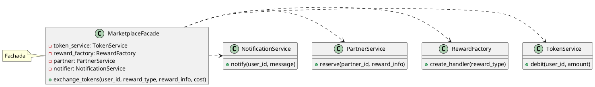

# Padrão de Projeto: Facade (Fachada)

**Grupo:** G4 - T02 - 2025.2 **Disciplina:** Padrões de Projeto **Projeto:** SustentabilizeJá **Data:** 24 de Outubro de 2025 **Autores:** Lucas de Oliveira Dias Marques Ferreira

## 1. Introdução

O padrão de projeto **Facade** (Fachada) é um padrão estrutural que fornece uma interface unificada para um conjunto de interfaces em um subsistema. Ele define um ponto de entrada de alto nível que torna o subsistema mais fácil de usar, encapsulando sua complexidade.

No projeto SustentabilizeJá, o `MarketplaceFacade` foi implementado para simplificar o processo de **orquestração de resgates de recompensas** no marketplace. O resgate de uma recompensa é um processo complexo que envolve a interação com vários subsistemas:

1. **Serviço de Tokens:** Para debitar o custo da recompensa do saldo do usuário.

1. **Fábrica de Recompensas (****`RewardFactory`****):** Para criar o objeto de recompensa apropriado.

1. **Serviço de Parceiros:** Para reservar ou confirmar a recompensa com o parceiro.

1. **Serviço de Notificação:** Para informar o usuário sobre o sucesso ou falha da transação.

Sem a Fachada, o código cliente teria que gerenciar todas essas interações e suas dependências.

## 2. Metodologia

A classe `MarketplaceFacade` atua como a Fachada, expondo um único método simples (`exchange_tokens`) para o cliente. Este método orquestra a sequência de chamadas para os diferentes subsistemas:

1. Verifica e debita tokens usando o `TokenService`.

1. Cria o handler de recompensa apropriado usando o `RewardFactory`.

1. Executa a lógica de resgate (`redeem`) no handler.

1. Reserva a recompensa com o `PartnerService`.

1. Notifica o usuário usando o `NotificationService` em caso de sucesso ou falha.

Dessa forma, o código que utiliza a Fachada (`exchange_tokens`) é muito mais limpo, desacoplado e focado na regra de negócio de alto nível, sem se preocupar com os detalhes de implementação de cada subsistema.

## 3. Diagrama UML (PlantUML)

O diagrama de classes a seguir ilustra a estrutura do padrão Facade aplicado ao módulo de marketplace do SustentabilizeJá.



## 4. Código-Fonte

O código-fonte do arquivo `marketplace/facade.py` demonstra a implementação do padrão.

```python
from tokens.servicos.token_servico import TokenService
from rewards.factory import RewardFactory
# Outros subsistemas simulados para simplificar o exemplo
# (PartnerService e NotificationService)

class PartnerService:
    """Subsistema 1: Serviço de comunicação com parceiros."""
    def reserve(self, partner_id: str, reward_info: dict) -> bool:
        # Lógica real de integração com parceiro
        print(f"[PartnerService] Reserving at {partner_id} for {reward_info}")
        return True

class NotificationService:
    """Subsistema 2: Serviço de envio de notificações."""
    def notify(self, user_id: str, message: str):
        # Lógica real de envio de notificação (e-mail, push, etc.)
        print(f"[Notification] To {user_id}: {message}")

class MarketplaceFacade:
    """A Fachada que simplifica o processo de troca de tokens por recompensas."""
    def __init__(self, token_service: TokenService = None):
        # Injeção de dependências dos subsistemas
        self.token_service = token_service or TokenService()
        self.reward_factory = RewardFactory()
        self.partner = PartnerService()
        self.notifier = NotificationService()

    def exchange_tokens(self, user_id: str, reward_type: str, reward_info: dict, cost: int):
        """
        Método de alto nível para orquestrar o resgate de tokens.
        
        Orquestração:
        1. Debita tokens.
        2. Cria o handler de recompensa.
        3. Executa o resgate (redeem).
        4. Confirma a reserva com o parceiro.
        5. Notifica o usuário.
        """
        
        # 1. Debitar tokens
        if not self.token_service.debit(user_id, cost):
            self.notifier.notify(user_id, "Saldo insuficiente para o resgate.")
            return {"status":"failed","reason":"insufficient_tokens"}
            
        # 2. e 3. Criar e Resgatar Recompensa (usa Factory Method)
        handler = self.reward_factory.create_handler(reward_type)
        result = handler.redeem(user_id, reward_info)
        
        # 4. Reservar com Parceiro
        partner_id = reward_info.get("partner_id","parceiro_default")
        if not self.partner.reserve(partner_id, result):
            # Em caso de falha, seria ideal reverter o débito de tokens
            self.notifier.notify(user_id, "Erro ao reservar com parceiro.")
            return {"status":"failed","reason":"partner_error"}
            
        # 5. Notificar Sucesso
        self.notifier.notify(user_id,f"Recompensa '{reward_type}' resgatada com sucesso: {result}")
        return {"status":"success","detail":result}

# Exemplo de Uso (para fins de documentação)
# facade = MarketplaceFacade()
# # Cliente não precisa se preocupar com TokenService, RewardFactory, etc.
# result = facade.exchange_tokens("user123", "discount", {"partner_id": "EcoPartner", "percent": 0.2}, 50)
# print(result)
```

## 5. Conclusão

A implementação do `MarketplaceFacade` no SustentabilizeJá alcançou o objetivo de **simplificar a interface** para o complexo subsistema de resgate de recompensas. O padrão Facade reduziu o acoplamento entre o código cliente e os subsistemas internos, tornando o módulo de marketplace mais **fácil de entender, manter e evoluir**.

## 6. Histórico de Versões

| Versão | Data | Descrição |
| --- | --- | --- |
| 1.0 | 24/10/2025 | Criação inicial do artefato. |

---

**Link para o código no repositório (exemplo):** [marketplace/facade.py](https://github.com/SustentabilizeJa/sustentabilize-ja/blob/main/marketplace/facade.py)
