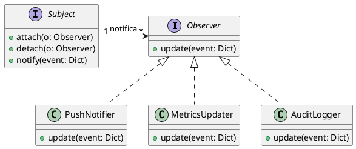

# Padrão de Projeto: Observer (Observador)

**Grupo:** G4 - T02 - 2025.2
**Disciplina:** Padrões de Projeto
**Projeto:** SustentabilizeJá
**Data:** 24 de Outubro de 2025
**Autores:** Lucas de Oliveira Dias Marques Ferreira

## 1. Introdução

O padrão de projeto **Observer** (Observador) é um padrão comportamental que define uma dependência um-para-muitos entre objetos, de modo que quando um objeto muda de estado, todos os seus dependentes são notificados e atualizados automaticamente.

No projeto SustentabilizeJá, o padrão Observer é fundamental para implementar o **sistema de notificações e métricas**. Ele permite que diferentes componentes do sistema reajam a eventos importantes (como o registro de uma nova ação sustentável ou o resgate de tokens) sem que o componente emissor do evento precise conhecer ou depender diretamente desses componentes.

## 2. Metodologia

A implementação do Observer no módulo `notifications` do SustentabilizeJá segue a estrutura padrão:

1.  **Assunto/Sujeito (`Subject`):** É o objeto que mantém uma lista de seus dependentes (Observadores) e notifica-os automaticamente sobre qualquer mudança de estado. No SustentabilizeJá, qualquer serviço que gera um evento (ex: `TokenService` ao emitir tokens) pode implementar esta interface.
2.  **Observador (`Observer`):** Define uma interface de atualização para objetos que devem ser notificados sobre mudanças no Assunto. O método `update` é chamado pelo Assunto.
3.  **Observadores Concretos (`PushNotifier`, `MetricsUpdater`, `AuditLogger`):** Implementam a interface `Observer` e contêm a lógica específica para reagir ao evento. Por exemplo, um notifica o usuário, outro atualiza um painel de métricas e o terceiro registra o evento para fins de auditoria.

Isso garante um alto nível de **desacoplamento**, permitindo que novas reações a eventos sejam adicionadas (ex: um `EmailSender`) sem alterar o código do emissor do evento.

## 3. Diagrama UML (PlantUML)

O diagrama de classes a seguir ilustra a estrutura do padrão Observer aplicado ao sistema de notificações do SustentabilizeJá.



## 4. Código-Fonte

O código-fonte do arquivo `notifications/observer.py` demonstra a implementação das interfaces e dos observadores concretos.

```python
from abc import ABC, abstractmethod
from typing import Dict, Any, List

# --- Interface do Observador ---
class Observer(ABC):
    """Define a interface de atualização para objetos que devem ser notificados."""
    @abstractmethod
    def update(self, event: Dict[str, Any]):
        pass

# --- Interface do Assunto (Subject) ---
class Subject(ABC):
    """Define o objeto que notifica seus observadores."""
    @abstractmethod
    def attach(self, o: Observer):
        """Anexa um observador à lista."""
        pass
    @abstractmethod
    def detach(self, o: Observer):
        """Desanexa um observador da lista."""
        pass
    @abstractmethod
    def notify(self, event: Dict[str, Any]):
        """Notifica todos os observadores sobre um evento."""
        pass

# --- Observadores Concretos ---
class PushNotifier(Observer):
    """Observador que envia notificações push ao usuário."""
    def update(self, event: Dict[str, Any]):
        if event.get("type") == "tokens_issued":
            print(f"[PushNotifier] Push para {event['user_id']}: você recebeu {event['amount']} tokens.")

class MetricsUpdater(Observer):
    """Observador que atualiza as métricas do sistema em tempo real."""
    def update(self, event: Dict[str, Any]):
        print(f"[MetricsUpdater] Atualizando métricas: {event}")

class AuditLogger(Observer):
    """Observador que registra o evento para fins de auditoria e log."""
    def update(self, event: Dict[str, Any]):
        print(f"[AuditLogger] Registro de auditoria: {event}")

# Exemplo de Implementação de um Assunto Concreto (para fins de documentação)
class TokenIssuer(Subject):
    def __init__(self):
        self._observers: List[Observer] = []
        
    def attach(self, o: Observer):
        self._observers.append(o)
        
    def detach(self, o: Observer):
        self._observers.remove(o)
        
    def notify(self, event: Dict[str, Any]):
        for observer in self._observers:
            observer.update(event)

# Exemplo de Uso (para fins de documentação)
# issuer = TokenIssuer()
# issuer.attach(PushNotifier())
# issuer.attach(MetricsUpdater())
# issuer.attach(AuditLogger())
# 
# # Um evento ocorre: tokens são emitidos
# event_data = {"type": "tokens_issued", "user_id": "user456", "amount": 100, "source": "Reciclagem"}
# issuer.notify(event_data)
```

## 5. Conclusão

A aplicação do padrão Observer no SustentabilizeJá resultou em um sistema de eventos altamente **flexível** e **desacoplado**. A capacidade de adicionar novas reações a eventos (como a atualização de métricas ou o registro em log) sem modificar o código do emissor do evento é um exemplo claro da aderência ao princípio **Open/Closed**. Isso facilita a manutenção e a evolução do sistema de notificações e métricas.

## 6. Histórico de Versões

| Versão | Data | Descrição |
| :---: | :---: | :---: |
| 1.0 | 24/10/2025 | Criação inicial do artefato. |

***

**Link para o código no repositório (exemplo):**
[notifications/observer.py](https://github.com/SustentabilizeJa/sustentabilize-ja/blob/main/notifications/observer.py)

